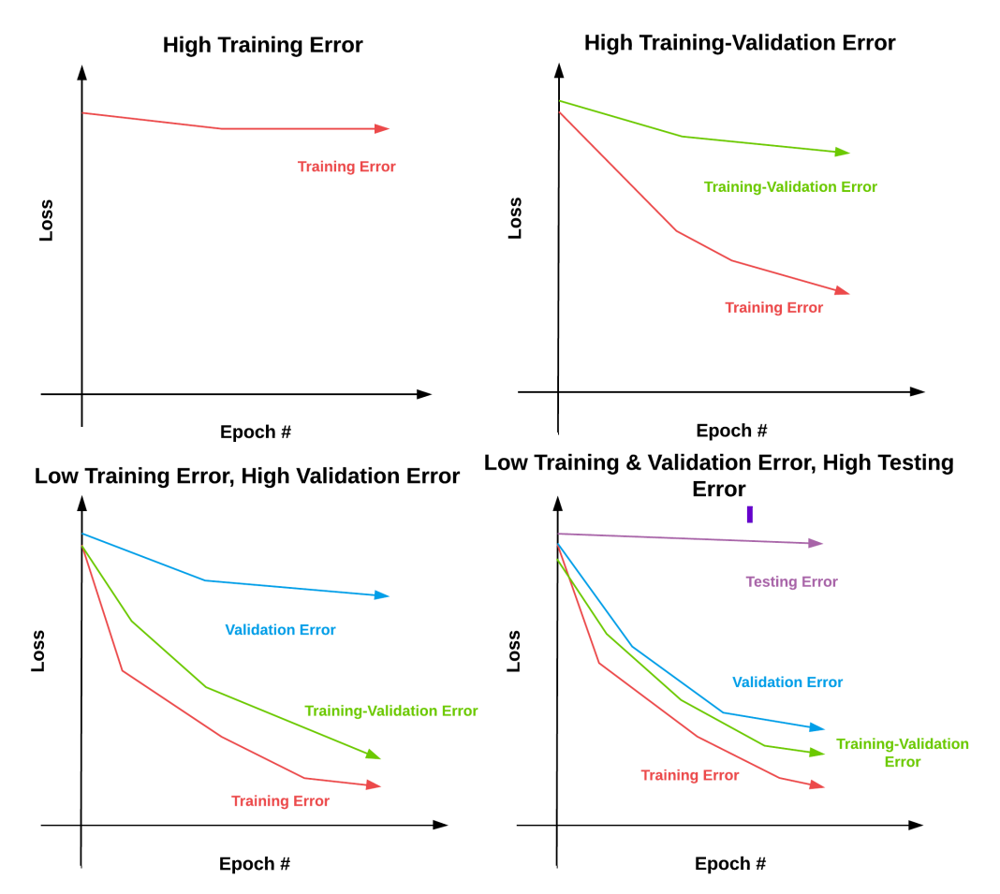

# Aide-mémoire : Apprentissage Paramétrisé

Ce document regroupe les concepts clés et les étapes principales de l'apprentissage paramétrisé à partir du notebook d'exemple.

---

## Concepts clés

1. **Paramétrisation :**
   - Définir et ajuster les paramètres d’un modèle (poids et biais).

2. **Fonction de perte (Loss Function) :**
   - Mesure la différence entre les prédictions et les étiquettes réelles.

3. **Gradient et descente de gradient :**
   - Le _gradient_ guide la direction d’optimisation.
   - La _descente de gradient_ ajuste progressivement les paramètres pour minimiser la perte.

4. **Sigmoïde (fonction d'activation) :**
   - Formule : 
     σ(x) = 1 / (1 + exp(-x))
   - Aplatie les valeurs d'entrée dans un intervalle entre 0 et 1.

---

## Etapes principales du modèle

### 1. Initialisation
- Les poids (`W`) sont initialisés avec des petites valeurs aléatoires proches de 0.
- Les biais (`b`) sont initialisés à 0.

### 2. Propagation avant (Forward Pass)
- Calcul des sorties du modèle via une fonction linéaire puis activation (exemple : `sigmoïde`).

Formule : `f(x, W, b) = σ(W · x + b)`

où :
- `σ` est la fonction sigmoïde,
- `W · x` désigne le produit scalaire entre les poids et les entrées.

---

### Exemple de produit scalaire :
Soit deux vecteurs :
- x = [2, 3]
- w = [0.5, -1]

Le produit scalaire `W · x` est calculé comme :
(2 * 0.5) + (3 * -1) = 1 - 3 = -2.

---

### 3. Rétropropagation (Backward Pass)
- Adapte les poids et biais selon :
  - Le gradient (dérivée partielle par rapport à la perte).
  - Un taux d’apprentissage.

Pseudo-code :
```python
while True:
    Wgradient = evaluate_gradient(loss, data, W)
    W += -alpha * Wgradient
```

### 4. Boucle d’entraînement
- Répétition des étapes de propagation avant et arrière sur un certain nombre d’epochs.
- Durée contrôlée par le taux d’apprentissage et la convergence de la perte.

---

## Evaluation du modèle

1. **Calcul des scores :**
    - Prédictions générées via `forward pass` avec les données de test.

2. **Rapport de classification :**
    - Rapport généré via `classification_report` (de `scikit-learn`).

Exemple de code :
```python
from sklearn.metrics import classification_report
print(classification_report(y_test, np.around(preds)))
```

## Loss overfit



---

## Ressources supplémentaires

- [Article recommandé sur la descente de gradient](https://www.charlesbordet.com/fr/gradient-descent/#comment-ca-marche)